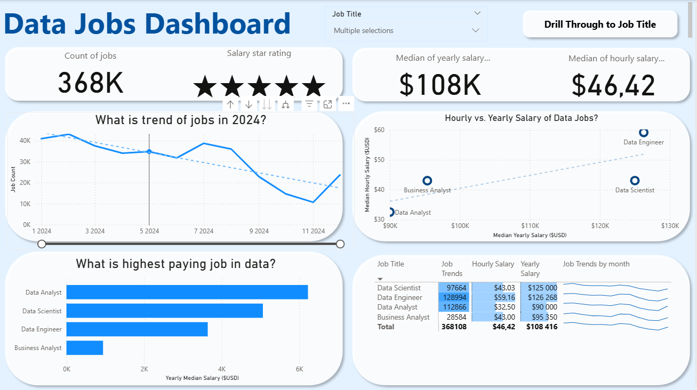
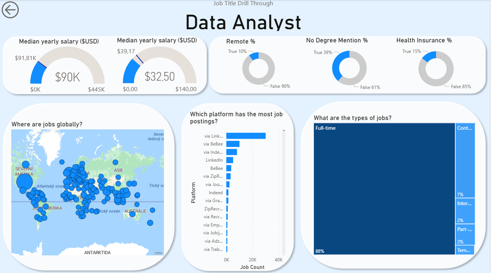

# Power BI_Data_Jobs Dashboard

## Introduction

Navigating though job market can be very difficult with information scattered in different places. This dashboard was created for **job seekers** to solve this problem and help them find all necessecary information in one place, nabeling them to get better understanding of the market and adjust themselves accordingly. Using a real-world dataset of 2024 data science job postings, this project provides an easy-to-use interface to explore market trends and accurate salaries.

### Dashboard File
You can find the file for the dashboard here: [`Data_Jobs.pbix`](Project_1.pbix).  

## Skills Showcased

This project was created by using these Power BI features:

-   **Data Transformation with Power Query:** Before loading into Power BI, data were firstly cleaned and prepared by handling blanks and changing data types.
-   **Implicit Measures:** Formulated measures to derive key insights and KPIs like Median Yearly Salary and Job Count.  
-   **Dashboard Design:** Designed an intuitive and visually appealing layout.
-    Visualizations utilized:
      -   Core Charts: Column, Bar, Line, and Area charts for comparisons and trends.
      -   Map Charts: For displaying geospatial data and displaying global distribution of jobs.
      -   Cards: To highlight key performance indicators.
      -   Tables: For presenting detailed, tabular information.
-   **Interactive Reporting:**
    -   **Slicers:** To dynamically filter the report by Job Title.
    -   **Buttons & Bookmarks:** To create an intuitive navigation experience.
    -   **Drill-Through:** To navigate from a high-level summary to a detailed view.

## Dashboard Overview

*This report provides both a high-level summary page and a detailed analysis one.*

### Page 1: High-Level Market View

This is a general overview for the data job market. It showcases key KPIs like total job count, median salaries (yearly, hourly) about data jobs to give you a quick understanding of what's happening in the job market.

### Page 2: Job Title Drill Through

This is the deep-dive page giving more in detail information about each position. From the main dashboard, you can click and drill through to this view including information about salary ranges, types of jobs, work-from-home statistics, degree requirements, top-hiring platforms and a global map of job locations.

## Conclusion

This dashboard showcases Power BI's ability to transform large datasets about job posting into a powerful tool for career analysis. It allows Job Seekers to filter and explore essential market insights efficiently, helping them make informed decisions about their next career move.
